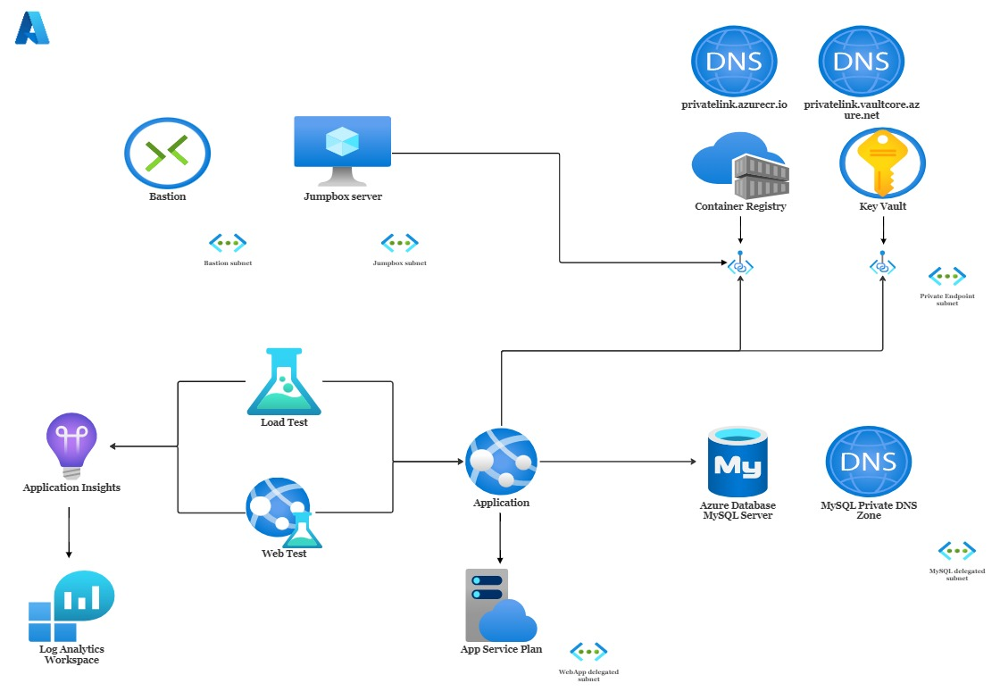

# WordPress on Azure: Part 1 - Architecture

## Overview

As you can see in the diagram above, the WordPress infrastructure consists of the following key components:

* **WebApp with its App Service Plan:** which will be the service that hosts our WordPress site.

* **Azure Container Registry:** which will store the WordPress image.

* **Key vault:** which will store the passwords of the MySQL admin and the jumpbox user.

* **Azure Database for MySQL Flexible Servers:** which will be used for the wordpress database.

* **Jumpbox server**: which is an Ubuntu virtual machine used for management purposes, like importing the WordPress image into the ACR.
  
Monitoring and testing resources (like Azure Load Testing) will be covered in Part 4.

## Network access

We want to make our infrastructure as secure as possible, and for this reason, we are going to follow some best practices. First of all, both the ACR and the KeyVault will be accessible through their own private endpoints. We also want to ensure that traffic to the MySQL server flows only through the virtual network, which is why we opt to inject the service into our virtual network. Moreover, it would be a good idea to not access the jumpbox directly through a public IP, so instead we use the Bastion service.

## WebApp

Since we have disabled the public endpoints of the resources mentioned, we need to enable vnet integration for the WebApp in order for it to be able to access them. Specifically, our WebApp:

* will pull the WordPress image from the ACR

* will fetch the MySQL admin password using a keyvault reference

* will connect to the MySQL server and update the wordpress database

Regarding the permissions needed, we use a system-assigned identity with the AcrPull role and the Get-Secret access policy assigned.

## Summary

That pretty much covers the details of our architecture. In the next part, we are going to cover the code that will be used to deploy our infrastructure.

**Next part:**

* [**Part 2: Infrastructure as Code**](Part-2-IaC.md)

**Previous parts:**

* [**Part 0: Introduction**](Part-0-Introduction.md)

**Related blog post:** <https://cloud-on-rails.com/2022/11/07/wordpress-on-azure-part-1-architecture/>
