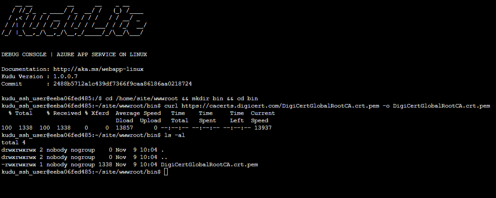
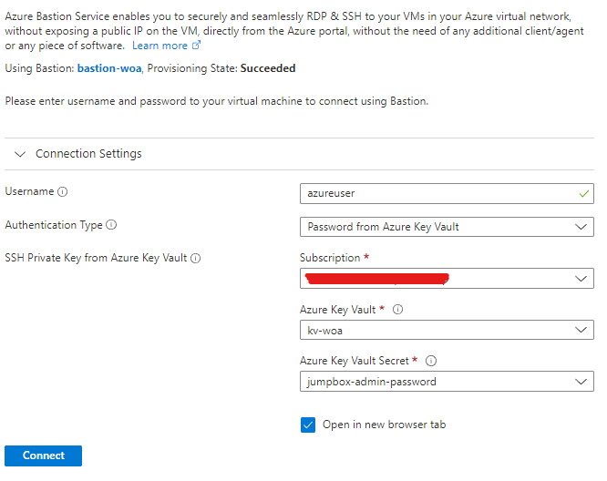

# WordPress on Azure: Part 3 - Deployment

Hello, fellow Azure enthusiasts! In today’s blog post, we look into the deployment of our [Azure infrastructure](Part-1-Architecture.md) and some post-configuration steps.


We use GitHub Actions to deploy our infrastructure.

In the repository, there are two workflow files: one to deploy the infrastructure and one to tear it down.

We will go over some of the elements inside the ***deploy.yaml*** workflow.

## GitHub Actions

### Prerequisites to connect to Azure

* Create [an Azure Active Directory application and service principal](https://learn.microsoft.com/en-us/azure/active-directory/develop/howto-create-service-principal-portal)

* Set up [federation](https://learn.microsoft.com/en-us/azure/developer/github/connect-from-azure?tabs=azure-portal%2Cwindows) and update the repository secrets

* Make sure you give ***Owner*** permissions over the subscription (to be more secure you can use [PIM](https://learn.microsoft.com/en-us/azure/active-directory/privileged-identity-management/pim-configure))

* According to the [documentation](https://docs.github.com/en/actions/deployment/security-hardening-your-deployments/configuring-openid-connect-in-azure), the following must be included in the workflow file:

```yaml
permissions:
  id-token: write
  contents: read
```

### Connect to Azure and set subscription

```yaml
- name: Azure Login
uses: Azure/login@v1
with:
  client-id: ${{ secrets.AZURE_CLIENT_ID }}
  tenant-id: ${{ secrets.AZURE_TENANT_ID }}
  subscription-id: ${{ secrets.AZURE_SUBSCRIPTION_ID }}
```

### Deploy template

* Before we deploy the template, we first lint and then validate it

```yaml
- name: Validate template
  working-directory: ${{ github.workspace }}/bicep
  run: |
    az deployment sub validate \
      --name "$DEPLOYMENT_NAME" \
      --location westeurope \
      --template-file main.bicep \
      --parameters "main.parameters.json" \
                    subscription_id="$SUBSCRIPTION_ID" \
                    mysql_admin_password="$ADMIN_PASSWORD" \
                    jumpbox_admin_password="$ADMIN_PASSWORD" \
                    github_runner_object_id="${{ secrets.AZURE_CLIENT_ID }}"
```

## Post-configuration steps

### Download database certificate in Kudo environment

* Go to <https://{{app-service-name}}.scm.azurewebsites.net/DebugConsole>

* Run the following:

```bash
cd /home/site/wwwroot && mkdir bin && cd bin
curl https://cacerts.digicert.com/DigiCertGlobalRootCA.crt.pem -o DigiCertGlobalRootCA.crt.pem
```



### Import WordPress image to Azure Container Registry

* Allow your IP from the Key Vault's firewall and give yourself permission to get and list secrets through access policies

* Login to the jumpbox through Bastion using the credentials stored in the Key Vault



* Run the following:

```bash
az login --identity
cr_name="{your_registry_name}"
az acr import -n $cr_name --source docker.io/library/wordpress:latest --image wordpress:latest
az acr repository list -n $cr_name
```

### Install WordPress

* Wait 2-3 minutes after you import the image in the ACR
  
* Go to <https://{{app-service-name}}.azurewebsites.net>

* Follow the instructions mentioned

## Summary

So we deployed our infrastructure and completed the essential post-configuration tasks. In the following and final post, we will configure monitoring and run some tests on our WordPress website.

**Next part:**

* [**Part 4: Monitoring & Testing**](Part-4-Monitoring-and-Testing)

**Previous parts:**

* [**Part 0: Introduction**](Part-0-Introduction.md)

* [**Part 1: Architecture**](Part-1-Architecture.md)

* [**Part 2: Infrastructure as Code**](Part-2-IaC.md)

**Related blog post:** <https://cloud-on-rails.com/2022/12/09/wordpress-on-azure-part-3-deployment/>
